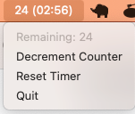

# GptTimer.app

A simple menu bar utility that helps you keep track of your GPT-4 quota.



## Installation

Create a venv and install requirements.txt

```bash
python3 -m venv venv
source venv/bin/activate
pip install -r requirements.txt
```

Run the setup.py script to build the .app file.

```bash
python setup.py py2app
```

Move the app to your Applications folder.

## License

MIT

